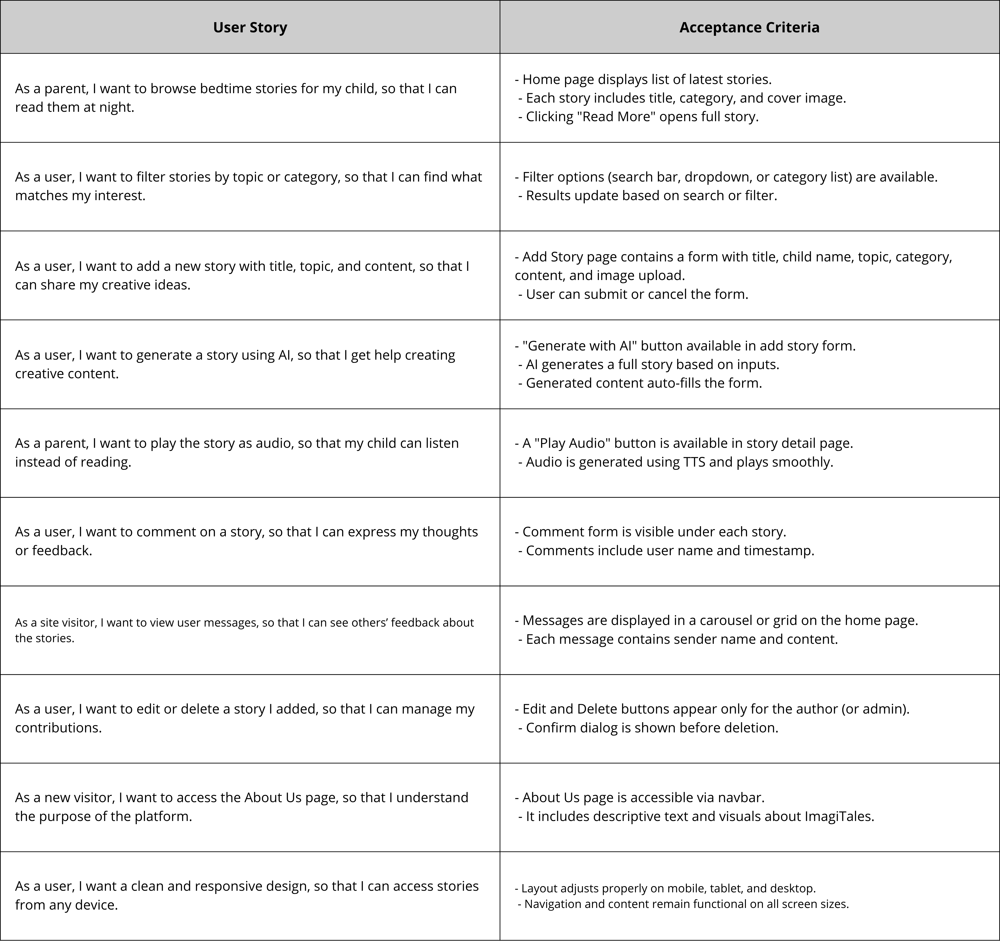
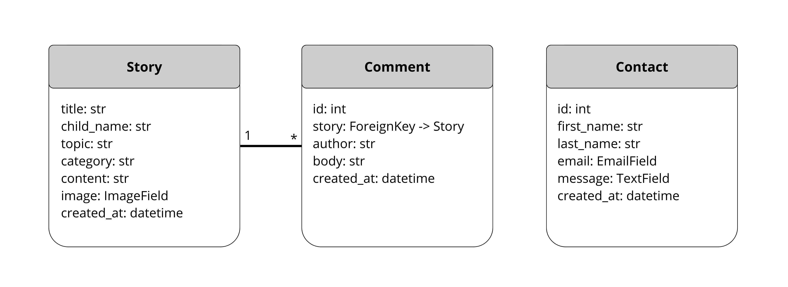
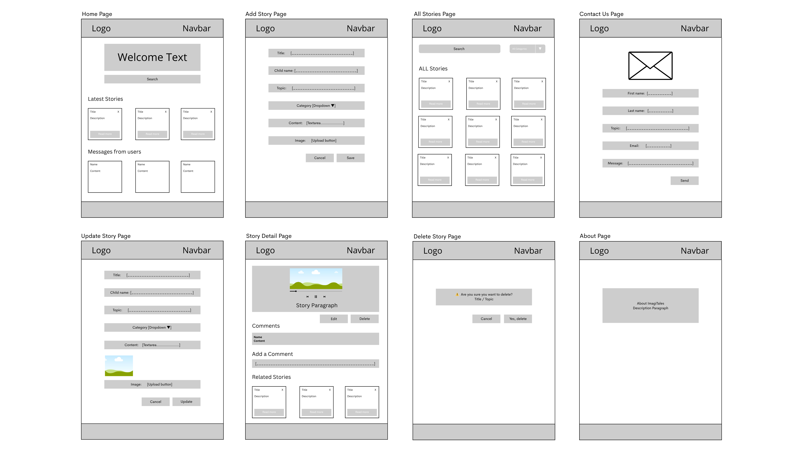

# 🌟 ImagiTales

**ImagiTales** is a creative web platform that allows users to generate, explore, and listen to AI-powered children's stories. With support for storytelling, filtering, commenting, and text-to-speech narration, it offers an engaging experience for kids and parents alike.

---

## ✨ Features

- ⚡ **Instant Story Generation with AI** for fast and tailored storytelling.
- 🧒 **Personalized Content** (e.g., child name and topic) to make stories more relatable.
- 🔍 **Smart Filtering & Search** by topic or category to help users find stories easily.
- 💬 **Interactive Commenting** to engage users and allow feedback under each story.
- 🔊 **Text-to-Speech Playback** so children can listen to stories hands-free.
- 📱 **Fully Responsive Interface** that works beautifully on phones, tablets, and desktops.
- 🎨 **Modern & Dark-Themed Design** for a visually pleasant and calming reading experience.
- 🖼️ **Visual Story Previews** with story images for a more immersive browsing experience.

---

## 👤 User Stories



---

## 🧠 UML Diagram



---

## 🖌️ Wireframe



---

## 🛠 Tech Stack

- **Framework**: Django
- **Styling**: Bootstrap 5 + Custom CSS
- **Database**: SQLite
- **AI Tools**: Cohere (Text Generation), Edge TTS (Speech Synthesis)
- **Deployment**: GitHub + Localhost

---

## 📂 Project Structure

```plaintext
Story/
├── main/
├── stories/
├── contact/
├── static/
├── media/
├── templates/
├── .env
├── requirements.txt
├── db.sqlite3
└── manage.py
```

---

## 🚀 How to Use ImagiTales

Follow these simple steps to explore and enjoy the ImagiTales platform:

### 🧑 For Visitors (Non-Developers):
1. **Visit the Homepage:** You'll find the latest featured stories and heartwarming user messages.
2. **Browse Stories:**
   - Go to the “All Stories” page to explore all available content.
   - Use the search bar or filter by topic/category to narrow down your results.
3. **Read & Listen:**
   - Click on a story card to read the full story.
   - Use the built-in audio player to listen to the story via text-to-speech narration.
4. **Leave a Comment:**
   - Scroll to the bottom of a story and add your thoughts or feedback.
5. **Contact Us:**
   - Navigate to the Contact page and send us a message using the stylish form.

---

### 💻 For Developers (Local Setup):
1. **Clone the Repository:**
   ```bash
   git clone https://github.com/your-username/ImagiTales.git
   cd ImagiTales
   ```

2. **Create & Activate Virtual Environment:**
   ```bash
   python -m venv venv
   source venv/bin/activate  # For Windows: venv\Scripts\activate
   ```

3. **Install Dependencies:**
   ```bash
   pip install -r requirements.txt
   ```

4. **Setup Environment Variables:**
   - Create a `.env` file in the root directory.
   - Add your keys (e.g., `COHERE_API_KEY`, `DEBUG=True`).

5. **Apply Migrations:**
   ```bash
   python manage.py migrate
   ```

6. **Run the Server:**
   ```bash
   python manage.py runserver
   ```

7. **Access the Site:**
   - Visit `http://127.0.0.1:8000` in your browser.

---

> 🚀 *Built with love and imagination to make story time magical!*
